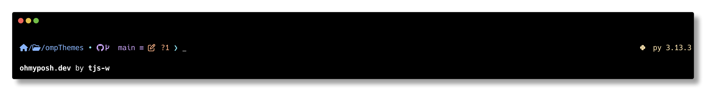

# Oh My Posh Themes

A collection of themes for [Oh My Posh](https://ohmyposh.dev/), a prompt theme engine for any shell.

## Lean Clean Theme



A minimal, clean theme for Oh My Posh that shows:

- Current directory path
- Git status with branch, staged/unstaged changes, and upstream info
- Language environments (Python, Go, Rust) on the right
- Exit status of the last command

### Installation

1. Make sure you have [Oh My Posh](https://ohmyposh.dev/docs/installation/linux) installed
2. Download the theme file
3. Add to your shell configuration:

```bash
# For Zsh
eval "$(oh-my-posh init zsh --config /path/to/lean-clean.omp.json)"

# For Bash
eval "$(oh-my-posh init bash --config /path/to/lean-clean.omp.json)"

# For Fish
oh-my-posh init fish --config /path/to/lean-clean.omp.json | source
```

### Features

- **Left Prompt**: Shows path, git status, and command prompt
- **Right Prompt**: Shows language environments and last command exit status
- **Transient Prompt**: Clean, minimal prompt for subsequent commands
- **Color Palette**: Uses modern, catppuccin-inspired colors

## License

MIT
